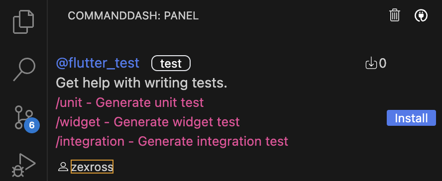

# Dash Agent 

Dash Agent is a framework enabling you to create and publish agents inside CommandDash marketplace. 

## Getting started

You can create a new dash agent using [dash-cli](https://pub.dev/packages/dash_cli) which automatically creates a starter project for you. 

```shell
dart pub global activate dash-cli
```

After activating the CLI, run the command to create your agent project. 

Replace `{{agent}}` with the unique name of your agent. 

```shell
dash_cli create {{agent}}
```

## Usage

This package contains the building blocks for creating dash agents:

### AgentConfiguration

The main part of the framework that glues together your agent configuration is `AgentConfiguration`.

Sample example of `AgentConfiguration`:

```dart
class MyAgent extends AgentConfiguration {
  final docsSource = DocsDataSource();

  @override
  List<DataSource> get registeredDataSources => [docsSource];

  @override
  List<Command> get registerSupportedCommands =>
      [AskCommand(docsSource: docsSource)];
}
```

The above AgentConfiguration registers your data sources and supported commands.

- `DataSource`: Data sources enable you to provide any form of data that your agent might need to perform its intended tasks.
- `Command`: Commands are the specialised tasks you want your agents to perform (like answering developer's query, refactoring, code generation, etc).

### Datasource

As described above data sources let you attach the data that your agent will need to perform its tasks. It can be anything from raw texts, JSON, file data, or even webpages.

Example for DataSource:

```dart
class DocsDataSource extends DataSource {

 /// Enables you to provide data stored in files and directories in your 
 /// local system.
 @override
 List<FileDataObject> get fileObjects => [
       FileDataObject.fromFile(File(
           'your_file_path')),
        FileDataObject.fromDirectory(Directory(
            'directory_path_to_data_source'))
     ];
 

 /// Enables you to provide raw string and json data
 @override
 List<ProjectDataObject> get projectObjects =>
     [ProjectDataObject.fromText('Data in form of raw text')];


 /// Enables your agent to use web pages by indexing specified web page 
 /// URLs or sitemaps in the object.
  @override
 List<WebDataObject> get webObjects =>
     [WebDataObject.fromWebPage('https://sampleurl.com'), 
     WebDataObject.fromSiteMap('https://sampleurl.com/sitemap.xml')];
}
```

**Note**: At the moment, storing only text-based files like code, markdown or raw text is supported.

### Commands

Commands are the specialised tasks you want your agents to perform  (such as refactoring, code generation, code analysis, etc). Once the agent is published, users can invoke this command in the command dash client (such as VS Code extensions) and use it. 

Sample example for `Command` object is shared below:

```dart
class AskCommand extends Command {
  AskCommand({required this.docsSource});

  final DataSource docsSource;

  // Inputs
  final userQuery = StringInput('Your query');
  final codeAttachment = CodeInput('Code Attachment');
  
  /// Unique identifier of the command
  @override
  String get slug => '/ask';

  /// Brief description of the command
  @override
  String get intent => 'Ask me anything';

  /// List of `DashInput`s that will be used in the command in its
  /// lifecycle
  @override
  List<DashInput> get registerInputs => [userQuery, codeAttachment];

  /// Series of operations that need to be performed for a command to
  /// finish its task
  @override
  List<Step> get steps {
      // Outputs
     final matchingDocuments = MatchDocumentObject();
     final queryOutput = QueryOutput();

      return [
        MatchingDocumentStep(
            query: '$userQuery$codeAttachment',
            dataSources: [docsSource],
            output: matchingDocuments),
        PromptQueryStep(
            prompt:
                '''You are an X agent. 
                
                Here is the $userQuery, here is the document references: $matchingDocuments. 
                
                Answer the user's query.''',
            postProcessKind: PostProcessKind.raw,
            output: queryOutput),
        AppendToChatStep(
            value:
                'This was your query: $userQuery and here is your output: $queryOutput'),
      ];
}
 
  /// Phrase that will be shown to user when the command is invoked
  @override
  String get textFieldLayout =>
      "Hi, I'm here to help you. $userQuery $codeAttachment";
}
```

One of the important elements of the `Command` object is the series of steps that you will be passing that will help the command to execute its tasks by performing the mini-tasks required to be performed by the main task.


### Step

Currently supported steps that are available for you to leverage are shared below:

- `MatchDocumentStep` - Helps you find the matching document from the provided data source form `DataSource` objects.
- `WorkspaceQueryStep` - Helps you find the matching code snippets from the user's project.
- `PromptQueryStep` - Enables you to perform a request to the LLM model with your customised prompt and instruction from the user to perform get generated code or any other general response that can be either used for the next steps or passed back to the user as the final response.
- `AppendToChatStep` - Enables you to append the response (anything like code, feedback, or general response) to the command dash client chat box.

In future more steps will be included in the list as the framework evolves.

## Additional information

We welcome the Flutter and AI enthusiasts likewise to contribute to this amazing open-source framework. You can contribute in the following ways:

-  **File feature requests**: Suggest features that'll make your development process easier in the [issues board](https://github.com/CommandDash/packages/issues).

-  **Pick up open issues**: Pick up and fix existing issues open to the community in [issues board](https://github.com/CommandDash/packages/issues).

-  **Participate in discussions**: Help by sharing your ideas in the [active discussions](https://join.slack.com/t/welltested-ai/shared_invite/zt-25u09fty8-gaggH9HbmopB~4tialTrlA) in our community slack.


## Testing Your Agents

After deploying your agent for testing using the `dash_cli publish --test` command, you'll find your agent labeled as test in the CommandDash agent marketplace, as illustrated below:

[](assets/test-agent-card.png)

Simply click on the "install" button, and you'll be able to test your newly created agent within the extension.

**Note**: Access the CommandDash agent marketplace page by clicking on the marketplace icon (highlighted in the red square) within the CommandDash extension:

[](assets/marketplace-icon.png)

## Community

Connect with like-minded people building with Flutter and using AI to do so, every step of the way :D [Join Now](https://join.slack.com/t/welltested-ai/shared_invite/zt-25u09fty8-gaggH9HbmopB~4tialTrlA)
