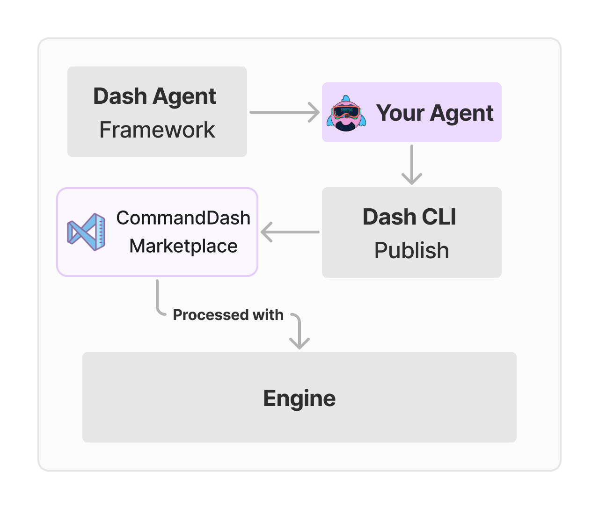

<h1 align="center">Dash Agents</h1>

 

<h3 align="center">Build and share your own in IDE Programming Agents</h3>

-----------------

Dash Agents Framework enables developers to create custom programming agents, expert at a defined task, and share them on the [CommandDash](https://github.com/CommandDash/commanddash) marketplace.

This repo contains the three parts that support the creation and execution of Dash Agents.

**For Agent Creators:**
* **`dash_cli`**:  A command-line interface for creating agent projects and publishing them to the CommandDash marketplace
* **`dash_agent`**: The framework that devs can use to build agents in Dart, defining data sources, commands (like "/ask", "/generate"), and the steps involved in each command.

**For Project Contributors:**
* **`commanddash(engine)`:** Processes the user's agent configuration defined in the framework by analyzing user's codebase, interacting with LLMs and providing the correct response to the IDE.

Read our [quickstart](https://www.commanddash.io/docs/quickstart) guide to get started with creating your own agents.

## Contributing

CommandDash is growing! 

* **Feature Requests:** Suggest new capabilities for the framework by opening an issue in the [issue tracker](https://github.com/CommandDash/packages/issues).
* **Bug Fixes:** Encountered any bug? Report to us and Pull Requests with fixes are welcome. 

We are excited to see what you build with CommandDash!